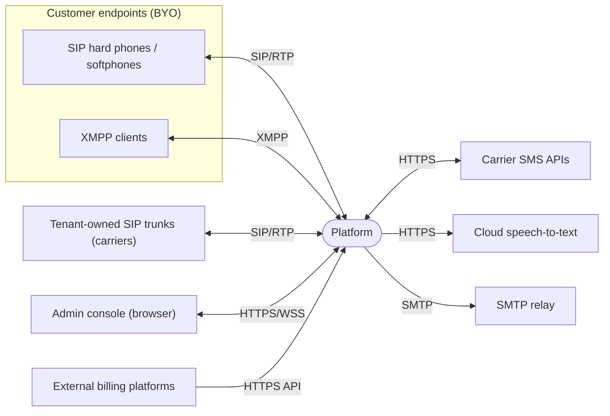
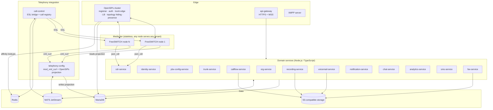
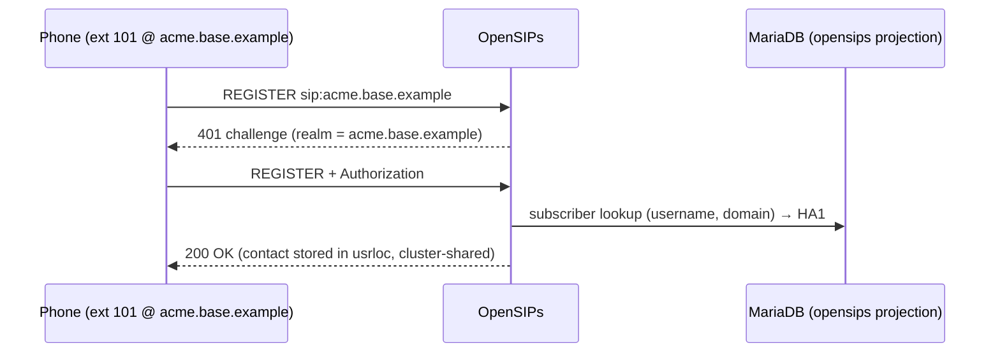
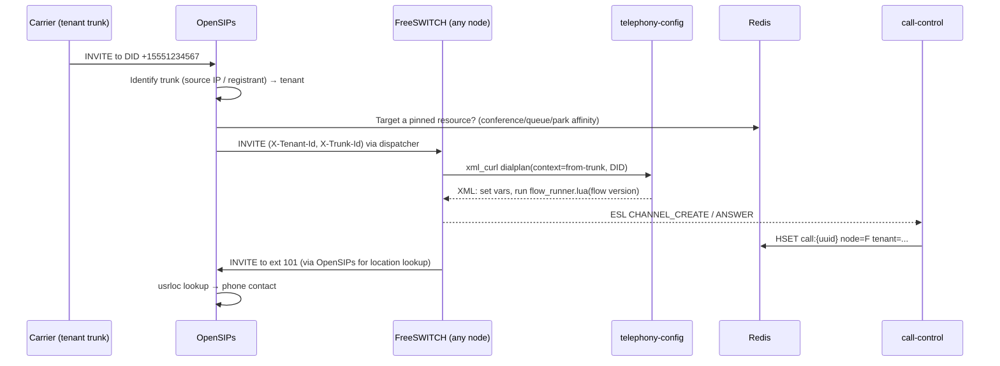
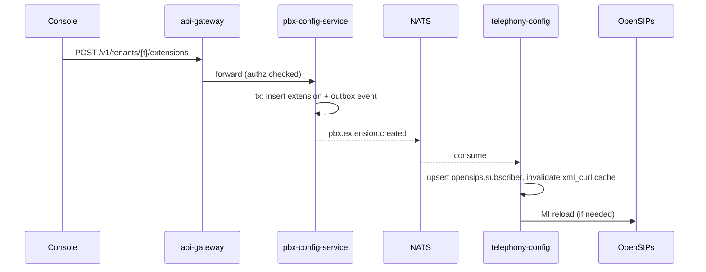

# 01 — System overview

## 1. Context



## 2. Container view



### Tiers

| Tier | Contents | State |
|---|---|---|
| Edge | OpenSIPs, api-gateway, XMPP server | OpenSIPs holds registrations and dialogs, replicated inside its cluster |
| Media | FreeSWITCH nodes | **Stateless apart from live calls.** All config comes from `telephony-config`, all persistent media goes to S3 |
| Telephony integration | `telephony-config`, `call-control` | The only services that talk to FreeSWITCH or OpenSIPs directly |
| Domain | Business microservices | Each owns its own database schema |
| Data | MariaDB, Redis, NATS, S3 | Redis is ephemeral; MariaDB and S3 are the systems of record |

## 3. Key architectural principles

1. **FreeSWITCH nodes are cattle.** A node holds nothing that must outlive a call: no local directory, dialplan, voicemail, prompts, or recordings. Any node can be replaced without data loss. This is what makes active-active work ([03](03-signaling-and-media.md), [04](04-high-availability.md)).
2. **Two telephony integration services own all SIP/media knowledge.** Domain services never generate FreeSWITCH XML or OpenSIPs rows. They publish domain events, and `telephony-config` projects those events into switch-readable form.
3. **Tenant scoping is enforced at every layer:** the SIP domain in OpenSIPs and FreeSWITCH, the `tenant_id` column in every tenant-owned table, and the authorization check at every API.
4. **Nothing user-facing is branded except by a reseller.** See [02 §5](02-tenancy-and-branding.md#5-branding).
5. **Services are independently deployable** and communicate over REST (synchronous, OpenAPI-described) or events on NATS JetStream (asynchronous, via a transactional outbox).

## 4. Principal flows

### 4.1 Extension registration



A phone may connect to a **SIP proxy hostname** (`sip.<reseller base domain>`, or `sip.<platform base domain>` for direct tenants) as an outbound proxy while it registers to, and authenticates against, the tenant's domain above. The proxy name only decides which TLS certificate the phone sees; see [03 §2.3](03-signaling-and-media.md#23-sip-over-tls).

### 4.2 Inbound call from a tenant trunk



### 4.3 Configuration change



## 5. Monorepo layout

```
apps/
  console/                  Flutter web console (Dart)
services/
  api-gateway/
  org-service/
  identity-service/
  pbx-config-service/
  trunk-service/
  callflow-service/
  telephony-config/
  call-control/
  cdr-service/
  recording-service/
  voicemail-service/
  notification-service/
  chat-service/
  analytics-service/
  sms-service/
  fax-service/
  provisioning-service/     (Stage 8)
packages/                   Shared TypeScript libraries, published as @cuc/*
  config/  logger/  http/  db/  events/  authz/  audit/  crypto/
  storage/  testing/  api-contracts/  callflow-ir/
telephony/
  freeswitch/               Image, base XML, Lua (flow_runner, voicemail, uploader)
  opensips/                 Image, opensips.cfg templates, DB schema version pin
infra/
  compose/                  Local development stack
  deploy/                   Production manifests (after the orchestrator decision)
tests/
  sip/                      SIPp scenarios + harness
  e2e/                      Cross-service end-to-end tests
tools/
  brand-leak/               Forbidden-string scanner
  gen/                      Service & client generators
docs/
```

Tooling **(Proposed, D-001)**: pnpm workspaces and Turborepo for the TypeScript packages, with the Flutter app built by its own toolchain from CI. Each service builds a single container image.
