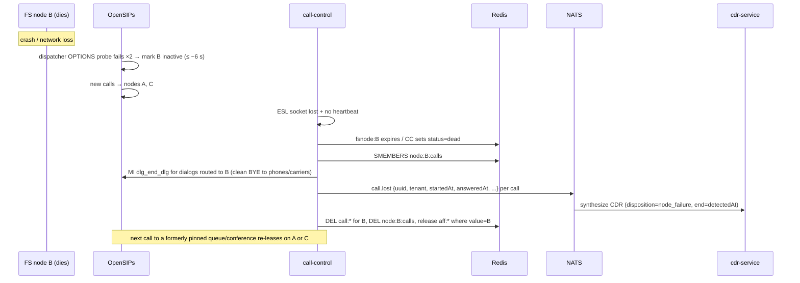

# 04 — High availability

## 1. Target behavior (from SAD §5.1)

- **Active-active** FreeSWITCH nodes. Any node serves any tenant.
- A node failure causes **brief disruption to calls in progress on that node only**. Callers redial. New calls succeed immediately on the surviving nodes.
- There is **no mid-call state replication** in v1.
- Redis holds **ownership records with a TTL and heartbeat**, not call-state snapshots.

## 2. Failure domains

| Component | HA mechanism | Failure impact |
|---|---|---|
| FreeSWITCH node | N+1 nodes behind the OpenSIPs dispatcher | Calls on that node drop. Pinned resources re-lease to another node. |
| OpenSIPs | Two or more nodes with `clusterer`: `usrloc` full-sharing, dialog replication, `uac_registrant` cluster sharing. Floating VIP (keepalived) or DNS SRV to the pair. | With dialog replication, established calls survive, because media doesn't flow through OpenSIPs. |
| telephony-config | At least 2 replicas behind a load balancer. FS falls back to its XML cache for recently seen keys. | If all replicas are down, new calls to uncached keys fail. |
| call-control | At least 2 replicas. ESL connections are split by a node-assignment lease so each FS node has exactly one active controller. | Events for affected nodes pause until another replica takes over (≤ 10 s). |
| Redis | Sentinel (1 primary + 2 replicas + 3 sentinels) | Failover within seconds. Registry rebuild on failover (§5). |
| MariaDB | Galera 3-node cluster, or primary with semi-sync replica (decision in S4) | Config writes pause during failover. Calls continue from the xml_curl caches. |
| NATS JetStream | 3-node cluster, R3 streams | None while quorum holds |
| S3 | Provider-managed | Uploaders buffer on the spool and retry |

## 3. Redis data model

All keys are prefixed with `cuc:{env}:`. Times are unix milliseconds.

### 3.1 Node liveness

| Key | Type | Value | TTL | Writer |
|---|---|---|---|---|
| `fsnode:{nodeId}` | hash | `addr`, `eslAddr`, `startedAt`, `status` (`up`/`draining`), `sessions`, `maxSessions`, `cpuIdle` | 10 s, refreshed every 3 s | `call-control` (from ESL `HEARTBEAT` plus its own ping) |
| `fsnodes` | set | nodeIds | none | `call-control` |

A node is **alive** iff `fsnode:{id}` exists and its status is `up`. A `draining` node receives no new calls or leases (used for rolling upgrades).

### 3.2 Call ownership

| Key | Type | Value | TTL |
|---|---|---|---|
| `call:{callUuid}` | hash | `node`, `tenant`, `direction`, `state` (`ringing`/`answered`/`held`), `startedAt`, `answeredAt`, `from`, `to`, `ext`, `queue`, `bridgedTo` | 6 h safety TTL; deleted on hangup |
| `node:{nodeId}:calls` | set | call UUIDs | none (cleaned on node death) |
| `tenant:{tenantId}:calls` | set | call UUIDs | none (cleaned on hangup and node death) |

Writers: `call-control`, driven by ESL `CHANNEL_CREATE`, `CHANNEL_ANSWER`, `CHANNEL_BRIDGE`, `CHANNEL_HOLD`, and `CHANNEL_HANGUP_COMPLETE`. Readers: monitoring (which node do I barge on?), live dashboards, and failover cleanup.

### 3.3 Resource affinity leases

| Key | Value | TTL |
|---|---|---|
| `aff:{tenantId}:{kind}:{resourceId}` | `nodeId` | 30 s lease, renewed every 10 s by `call-control` while the resource is active on that node |

`kind` ∈ `queue`, `park`, `conf`.

Acquisition: `SET aff:… {node} NX PX 30000`. The node is chosen by least load among live nodes. On success, `call-control` sends `xml_flush_cache` and module reload commands to the chosen node so it loads that resource's config. When a resource goes idle (for example, an empty conference), the lease is allowed to lapse.

OpenSIPs reads the lease with `cachedb_redis` when routing an inbound call to a pinned resource. That covers a DID that maps directly to a queue or conference. Resources reached from inside a flow are handled by FS itself: if the resource is leased to another node, the runner **transfers the call** to that node through OpenSIPs with an `X-Affinity-Node` hint (a "hairpin"). Otherwise the runner acquires the lease locally.

Queues: an agent's phone can be rung from any node, because the call to the phone goes through OpenSIPs. Only the queue's waiting callers and its `mod_callcenter` state are pinned.

## 4. Failover sequence

Timing targets:

- Dead-node detection ≤ 10 s. Dispatcher probing interval 2 s with 2 failures to deactivate, tuned in S4-08.
- New-call success on the surviving nodes: immediate for calls the dispatcher routes after deactivation.
- Waiting queue callers on the dead node are lost. Callers can hear a fast-busy or silence for up to the detection window.
- Recordings not yet uploaded from the dead node are lost (O-13).

## 5. Redis loss and rebuild

Redis is not a system of record. After a Redis failover with data loss:

1. `call-control` replicas re-announce nodes (`fsnode:*`).
2. For each node, `call-control` runs `show calls as json` and `show channels as json` over ESL and rebuilds `call:*` and the index sets.
3. For each node, it lists active conferences, queues, and parks and re-acquires the matching leases.

This rebuild MUST be idempotent and MUST complete within 30 s for 10 nodes at 1,000 calls each (S4-04 acceptance).

## 6. Rolling upgrades

To upgrade a node:

1. Set `fsnode:{id}.status=draining`, then call `ds_set_state` to mark the node probing-only in OpenSIPs.
2. Stop renewing its leases so pinned resources migrate as they go idle. Active conferences stay until empty.
3. Wait for sessions to reach 0 or for a maximum drain time, then stop the node.
4. Upgrade, then start it. It rejoins automatically.
