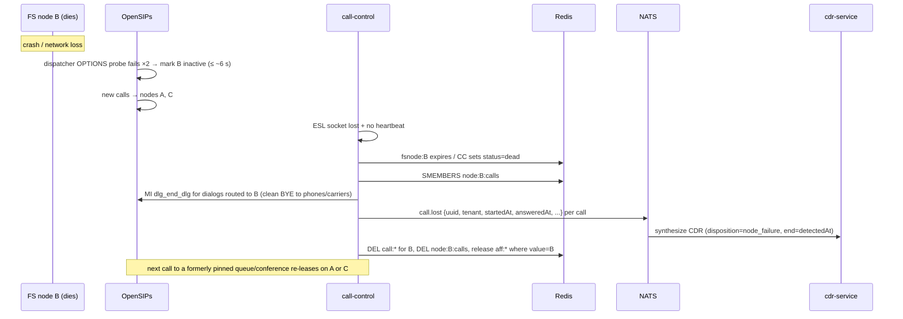

# 04 — High availability

## 1. Target behavior (from SAD §5.1)

- **Active-active** FreeSWITCH nodes. Any node serves any tenant.
- A node failure causes **brief disruption to calls in progress on that node only**. Callers redial. New calls succeed immediately on the surviving nodes.
- There is **no mid-call state replication** in v1.
- Redis holds **ownership records with a TTL and heartbeat**, not call-state snapshots.

## 2. Failure domains

| Component | HA mechanism | Failure impact |
|---|---|---|
| FreeSWITCH node | N+1 nodes behind the OpenSIPs dispatcher | Calls on that node drop. Pinned resources re-lease to another node. |
| OpenSIPs | Two or more nodes with `clusterer`: `usrloc` full-sharing, dialog replication, `uac_registrant` cluster sharing. Floating VIP (keepalived) or DNS SRV to the pair. | With dialog replication, established calls survive, because media doesn't flow through OpenSIPs. |
| telephony-config | At least 2 replicas behind a load balancer. FS falls back to its XML cache for recently seen keys. | If all replicas are down, new calls to uncached keys fail. |
| call-control | At least 2 replicas. ESL connections are split by a node-assignment lease so each FS node has exactly one active controller. | Events for affected nodes pause until another replica takes over (≤ 10 s). |
| Redis | Sentinel (1 primary + 2 replicas + 3 sentinels) | Failover within seconds. Registry rebuild on failover (§5). |
| MariaDB | Galera 3-node cluster, or primary with semi-sync replica (decision in S4) | Config writes pause during failover. Calls continue from the xml_curl caches. |
| NATS JetStream | 3-node cluster, R3 streams | None while quorum holds |
| S3 | Provider-managed | Uploaders buffer on the spool and retry |

## 3. Redis data model

All keys are prefixed with `cuc:{env}:`. Times are unix milliseconds.

### 3.1 Node liveness

| Key | Type | Value | TTL | Writer |
|---|---|---|---|---|
| `fsnode:{nodeId}` | hash | `addr`, `eslAddr`, `startedAt`, `status` (`up`/`draining`), `sessions`, `maxSessions`, `cpuIdle` | 10 s, refreshed every 3 s | `call-control` (from ESL `HEARTBEAT` plus its own ping) |
| `fsnodes` | set | nodeIds | none | `call-control` |

A node is **alive** iff `fsnode:{id}` exists and its status is `up`. A `draining` node receives no new calls or leases (used for rolling upgrades).

### 3.2 Call ownership

| Key | Type | Value | TTL |
|---|---|---|---|
| `call:{callUuid}` | hash | `node`, `tenant`, `direction`, `state` (`ringing`/`answered`/`held`), `startedAt`, `answeredAt`, `from`, `to`, `ext`, `queue`, `bridgedTo` | 6 h safety TTL; deleted on hangup |
| `node:{nodeId}:calls` | set | call UUIDs | none (cleaned on node death) |
| `tenant:{tenantId}:calls` | set | call UUIDs | none (cleaned on hangup and node death) |

Writers: `call-control`, driven by ESL `CHANNEL_CREATE`, `CHANNEL_ANSWER`, `CHANNEL_BRIDGE`, `CHANNEL_HOLD`, and `CHANNEL_HANGUP_COMPLETE`. Readers: monitoring (which node do I barge on?), live dashboards, and failover cleanup.

### 3.3 Resource affinity leases

| Key | Value | TTL |
|---|---|---|
| `aff:{tenantId}:{kind}:{resourceId}` | `nodeId` | 30 s lease, renewed every 10 s by `call-control` while the resource is active on that node |

`kind` ∈ `queue`, `park`, `conf`.

Acquisition: `SET aff:… {node} NX PX 30000`. The node is chosen by least load among live nodes. On success, `call-control` sends `xml_flush_cache` and module reload commands to the chosen node so it loads that resource's config. When a resource goes idle (for example, an empty conference), the lease is allowed to lapse.

OpenSIPs reads the lease with `cachedb_redis` when routing an inbound call to a pinned resource. That covers a DID that maps directly to a queue or conference. Resources reached from inside a flow are handled by FS itself: if the resource is leased to another node, the runner **transfers the call** to that node through OpenSIPs with an `X-Affinity-Node` hint (a "hairpin"). Otherwise the runner acquires the lease locally.

Queues: an agent's phone can be rung from any node, because the call to the phone goes through OpenSIPs. Only the queue's waiting callers and its `mod_callcenter` state are pinned.

## 4. Failover sequence

```mermaid
sequenceDiagram
  participant FS as FS node B (dies)
  participant O as OpenSIPs
  participant CC as call-control
  participant R as Redis
  participant BUS as NATS
  participant CDR as cdr-service
  Note over FS: crash / network loss
  O->>O: dispatcher OPTIONS probe fails ×2 → mark B inactive (≤ ~6 s)
  O->>O: new calls → nodes A, C
  CC->>CC: ESL socket lost + no heartbeat
  CC->>R: fsnode:B expires / CC sets status=dead
  CC->>R: SMEMBERS node:B:calls
  CC->>O: MI dlg_end_dlg for dialogs routed to B (clean BYE to phones/carriers)
  CC->>BUS: call.lost {uuid, tenant, startedAt, answeredAt, ...} per call
  BUS->>CDR: synthesize CDR (disposition=node_failure, end=detectedAt)
  CC->>R: DEL call:* for B, DEL node:B:calls, release aff:* where value=B
  Note over O,CC: next call to a formerly pinned queue/conference re-leases on A or C
```

Timing targets:

- Dead-node detection ≤ 10 s. Dispatcher probing interval 2 s with 2 failures to deactivate, tuned in S4-08.
- New-call success on the surviving nodes: immediate for calls the dispatcher routes after deactivation.
- Waiting queue callers on the dead node are lost. Callers can hear a fast-busy or silence for up to the detection window.
- Recordings not yet uploaded from the dead node are lost (O-13).

**As built (S4-04).** call-control's node-failure watcher (`node-failure.ts`) looks every second for nodes in `fsnodes` whose `fsnode:{id}` key has expired, skipping any node this replica's event socket is still connected to, and none at all for the first 2 × `HEARTBEAT_TTL_MS` after it starts (after every replica was down, every key has lapsed until the sockets reconnect). One replica claims each death (`nodelost:{id}`, `SET NX PX` 60 s) and, for each leg in `node:{id}:calls`, commits `call.lost` `{callUuid, nodeId, direction, startedAt, answeredAt, detectedAt, from, to, extension, sipCallId}` (tenant in `orgContext`) to the outbox and removes the leg from the registry; then it releases the node's leases (`handOver`). The teardown at the edge is by SIP Call-ID, not by destination: call-control records each leg's `sip_call_id` (at create, or at answer for an outbound leg), telephony-config ends that dialog with MI `dlg_end_dlg <call-id>` (a dialog already over is not an error), and OpenSIPs creates a dialog for every leg to or from a media node (`create_dialog()` before `topology_hiding()`, which alone did not create one; confirmed live). cdr-service writes one `node_failure` record per leg with a tenant (direction from the numbers, start on the whole second so a late real record deduplicates). api-gateway's live views show `call.lost` as `call.ended` (`NODE_FAILURE`). Confirmed live: a node killed mid-call, both phones got their BYE 10.8 s later (the heartbeat's 10 s expiry, then about a second).

## 5. Redis loss and rebuild

Redis is not a system of record. After a Redis failover with data loss:

1. `call-control` replicas re-announce nodes (`fsnode:*`).
2. For each node, `call-control` runs `show calls as json` and `show channels as json` over ESL and rebuilds `call:*` and the index sets.
3. For each node, it lists active conferences, queues, and parks and re-acquires the matching leases.

This rebuild MUST be idempotent and MUST complete within 30 s for 10 nodes at 1,000 calls each (S4-04 acceptance).

**As built (S4-04).** The registry carries an epoch (`registry:epoch`, no TTL), missing only when Redis lost its data (or is new). Every 2 s each call-control replica looks (`registry-rebuild.ts`). When it is missing, one replica claims a new one (`SET NX`) and, for each node it is connected to, lists the channels (`show channels as json`) and dumps each (`uuid_dump <uuid> json`, the same fields a channel event carries, so the event normalizer makes the record), then sets its answer, hold and bridge; a call live events have already recreated is left as it is, so the rebuild is idempotent. When the epoch has changed since a replica last looked, it sets again every lease it was renewing (`SET NX`; a lease taken meanwhile is left to its new owner). Unlike step 3 above, leases are restored from the replicas' own renewals rather than read from the nodes: a lease whose replica also restarted is acquired again by the next call, as after a drain. Nodes re-announce themselves through their heartbeats (every 3 s). Confirmed live: with a call up, every key of call-control's keyspace deleted, the call was back in the live list, answered and bridged, 0.6 s later. The 10 × 1,000 target is not load-tested yet (S4-09).

## 6. Rolling upgrades

To upgrade a node (as built in S4-02, [G-123](../decisions.md)):

1. `POST /internal/v1/nodes/{id}/drain` on call-control. It marks the node draining (`fsnodes:draining`, so `fsnode:{id}.status` stays `draining` through its heartbeats) and commits `call.node.drain_changed`. telephony-config sets the node's dispatcher rows inactive and calls `ds_set_state i` over MI, so OpenSIPs sends it no new calls. It is *inactive*, not *probing*: a probing node that answers its OPTIONS would rejoin by itself.
2. The same call releases the node's leases at once, so the next caller to each of its queues, parking lots and conferences re-pins it on a node in service. Calls already on the node stay. A busy conference can briefly run on two nodes until the old one empties (revisited in S4-05).
3. Wait for its `calls` (`GET /internal/v1/nodes/{id}`) to reach 0, then stop the node.
4. Upgrade and start it, then `POST /internal/v1/nodes/{id}/undrain`. A drain outlives the node's restart, so it never rejoins by accident.
