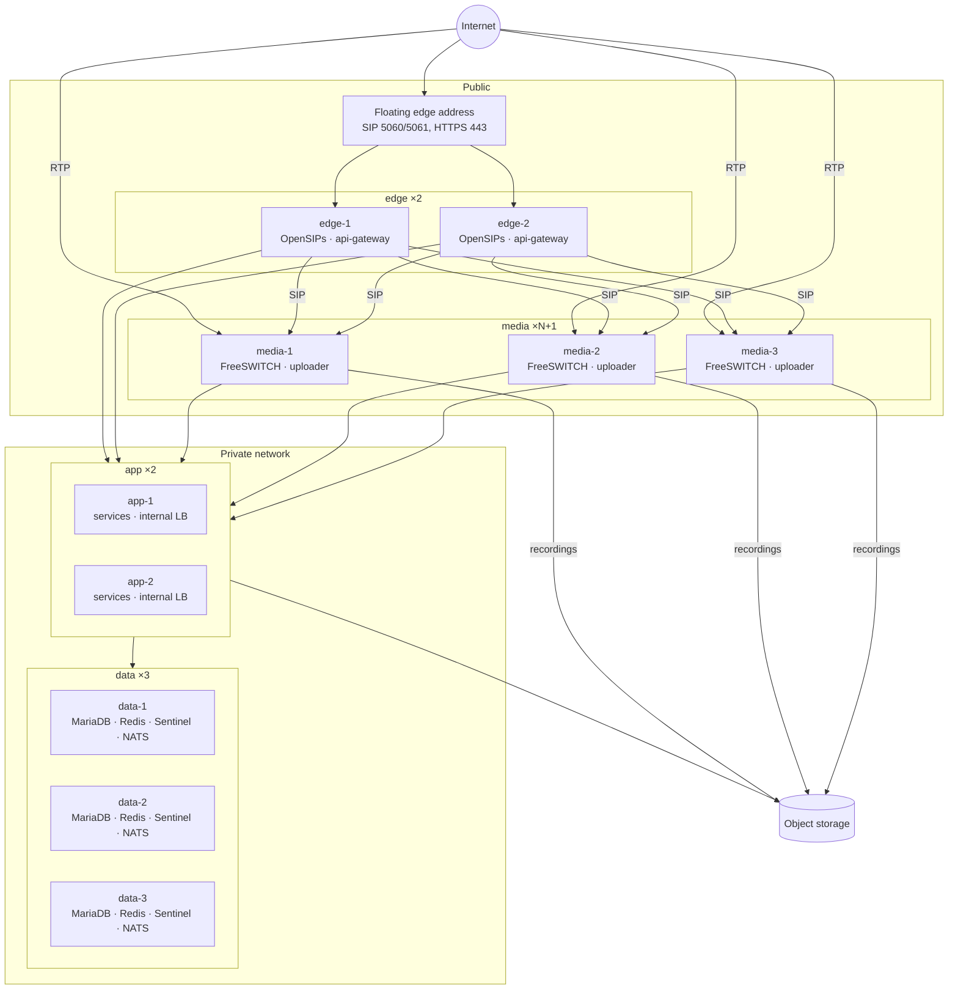

# 10 — Production topology

The layout the platform runs in when it is highly available: which servers exist, what runs on each, how every component survives the loss of one of its servers, and the stable address each client uses. It is the target for Stage 4. [ADR 0001](adr/0001-orchestrator.md) decides how containers are run (Compose per server; Kubernetes for the application tier later); this document decides where.

> **Status (S4-01).** A design, not a description of what runs today. Today the platform deploys as in [`deploy-distributed.md`](../operations/deploy-distributed.md): one edge, one app server and one data server, each a single point of failure. The last column of the §4 table says which S4 task builds each piece. Two choices here are **Proposed** and wait for the owner: the MariaDB HA form (§4.3, D-016) and the stable-endpoint mechanism (§4.1, D-017).

## 1. Principles

- **Redundancy by server, not by rescheduling.** Compose restarts a failed container on its own server, and that is all it does ([ADR 0001](adr/0001-orchestrator.md#consequences)). Surviving a server loss comes from running each component on at least two servers (three where a quorum is needed) with a stable address in front.
- **Telephony state stays on the telephony servers, and is disposable.** A media server's calls are lost with it, by design (SAD §5.1, [04](04-high-availability.md)); nothing else about it needs saving (CLAUDE.md rule 5). Calls in progress on the *other* servers are never affected by a failure.
- **Every durable thing has a quorum or a provider.** MariaDB, NATS and Redis Sentinel run as three members so one can be lost; object storage and (optionally) the database are managed services.
- **Single region, several availability zones.** Servers of one role are spread over zones so a zone loss takes out at most one copy of anything. Multi-region is out of scope for v1.

## 2. Server roles

| Role | Runs | Copies (HA) | Zones | Public address |
|---|---|---|---|---|
| **edge** | OpenSIPs (host network), api-gateway, keepalived | **2** | one per zone | Yes: the floating SIP/HTTPS address (§4.1) plus one of its own |
| **media** | FreeSWITCH (host network), recording-uploader | **N+1**, at least 2 (3 recommended) | spread | Yes: each its own, for RTP |
| **app** | The twelve application services; one internal load balancer each (§4.1) | **2** or more | spread | No |
| **data** | MariaDB member, Redis (primary or replica) + Sentinel, NATS member | **3** | one per zone | No |
| object storage | Hosted S3 | provider | provider | HTTPS |
| SMTP relay | Mail provider | provider | — | — |

Minimum HA footprint: 2 edge + 2 media + 2 app + 3 data = **9 servers**, plus hosted object storage. Media and edge sizes come from S4-09's measurements ([`sizing.md`](../operations/sizing.md)); the application and data servers are not measured yet.

## 3. Networks and zones

- **Public**: edge and media servers only. Edge publishes SIP and HTTPS on the floating address; each media server publishes its RTP range on its own address ([network §4](../operations/network-and-firewall.md#4-media-rtp-and-why-freeswitch-needs-a-public-address)).
- **Private**: every server, one network spanning the zones (a cloud VPC, or routed subnets). It carries all service, database, Redis, NATS, xml_curl and ESL traffic in the clear today, so it is the tenant-data security boundary ([deploy-distributed §3](../operations/deploy-distributed.md#3-the-private-network)); encrypting it (TLS to MariaDB/Redis/NATS, or WireGuard between zones) is a release-readiness item, not a topology one.
- **Zones**: each data server in its own zone (the quorum survives one zone); the two edges and two app servers in different zones; media servers spread so no zone holds more than half of them. Latency between zones must suit synchronous MariaDB replication (low single-digit milliseconds, which cloud zones in one region give).
- **Single-address settings widen to the role's subnet.** FreeSWITCH accepts SIP only from `FS_OPENSIPS_CIDR` and ESL only from `FS_CLUSTER_CIDR`, one CIDR each: give each role its own subnet (per zone, or one per role), or use a CIDR that covers both edges and both app servers.

**The role files (S4-11)** are in [`infra/deploy`](../../infra/deploy/README.md): one Compose file per role, one shared `platform.env` and a per-server `.env`, the released images (O-5's release workflow), rehearsed end to end on eight simulated servers (`infra/deploy/rehearsal`).

## 4. Components: how each survives, and the address clients use

### 4.1 Stable endpoints

There is no service discovery: every client is configured with one address per upstream ([ADR 0001](adr/0001-orchestrator.md#consequences)). So every component a client reaches must sit behind an address that stays put when a member dies. Three mechanisms, per environment (**D-017, decided by the owner 2026-09-28**):

| Mechanism | Where | Used for |
|---|---|---|
| **Floating address** (keepalived VRRP on premises; the provider's floating/elastic IP moved by a health-checked script, or a network load balancer, in clouds where VRRP does not work) | edge pair | The public SIP and HTTPS address |
| **Internal TCP/HTTP load balancer**: HAProxy on each app server, both listening on one private floating address (keepalived), or the provider's internal load balancer | app servers | Every service URL (`*_SERVICE_URL`, `TELEPHONY_CONFIG_URL`, `CALL_CONTROL_URL`), the MariaDB writer, the Redis primary |
| **Client knows every member** | built into the client | NATS (`NATS_SERVERS` lists all three), ioredis Sentinel mode for the Node services if preferred over the LB |

The internal load balancer health-checks what it balances: `/readyz` for services, `role:master` for Redis, the Galera sync state for MariaDB (§4.3).

### 4.2 The table

| Component | Copies | How it survives a server loss | Clients reach it through | Built today | Built in |
|---|---|---|---|---|---|
| **OpenSIPs** | 2 (edge) | `clusterer` with `usrloc` full-sharing, dialog replication and `uac_registrant` sharing; the floating address moves to the survivor. Established calls survive (media does not pass through OpenSIPs); phones stay registered | Phones and carriers: the floating address (or DNS SRV over both). FreeSWITCH: SIP from either edge | One copy, no clustering | S4-06 |
| **api-gateway** | 2 (edge) | Stateless; each copy's realtime hub reads every event itself | The floating HTTPS address (layer-4 pass-through, or a TLS-terminating balancer listed in `TRUSTED_PROXIES`) | Works in several copies | S4-11 (manifests) |
| **FreeSWITCH** | N+1 (media) | Active-active behind OpenSIPs' dispatcher: a dead node's calls end (cleanly, with synthetic CDRs), new calls go to the others; pinned queues, parks and conferences re-lease elsewhere ([04 §4](04-high-availability.md#4-failover-sequence)) | OpenSIPs dispatcher set 1, with probing, weights and draining | Round robin over nodes; no weights or draining; no dead-node cleanup; affinity not honoured at the edge (G-46) | S4-02, S4-04, S4-05 |
| **recording-uploader** | 1 per media server | Goes with its node; recordings not yet uploaded are lost with it (O-13, accepted) | — | Yes | — |
| **Stateless services** (identity, org, pbx-config, trunk, callflow, voicemail, cdr, media-worker, notification) | 2+ (app) | Run on every app server; the internal LB drops a dead one | Internal LB | Safe in several copies ([components §6](../operations/components.md#6-running-more-than-one-copy)) | S4-11 |
| **telephony-config** | 2+ (app) | As above; FreeSWITCH falls back to its xml_curl cache for recent keys meanwhile. Its background passes (reconcile, certificate sync, the presence poller, G-122) run in every copy today: idempotent but duplicated, and presence changes would be announced once per copy | Internal LB (FreeSWITCH's `TELEPHONY_CONFIG_URL`) | Works, with duplicated background work; reloads **one** OpenSIPs MI address | S4-06 (reload every edge), S4-03-style lease for the background passes |
| **recording-service** | 2+ (app) | As above; its retention sweep runs in every copy (harmless) | Internal LB | Works, with duplicated sweep | — |
| **call-control** | 2 (app) | Each FreeSWITCH node is assigned to exactly one replica by a lease in Redis; a replica that dies loses its leases and another takes its nodes within ≤ 10 s. Needs `FS_CLUSTER_CIDR` to cover both app servers | Internal LB for its HTTP routes (monitoring, recording buttons, affinity); ESL connections are outbound from it | **Exactly one copy only** | S4-03 |
| **MariaDB** | 3 (data) | **Decided (D-016):** Galera, three members, **one writer at a time** through the internal LB (the others as hot standbys the LB switches to). A primary with a semi-synchronous replica and a failover tool is the alternative (§4.3) | Internal LB writer address (`DB_HOST`); OpenSIPs' `db_url` the same | Galera cluster in `infra/data-ha` (S4-07); the everyday dev stack keeps one server | S4-07, S4-11 (manifests) |
| **Redis** | 3 (data) | Sentinel: one primary, two replicas, three sentinels. A failover loses at most the last writes; the call registry is rebuilt from the nodes ([04 §5](04-high-availability.md#5-redis-loss-and-rebuild)) | **Internal LB following the primary** (checks `role:master`). Required, not optional: FreeSWITCH's `mod_redis` (toll-fraud limits) and OpenSIPs' `cachedb_redis` (affinity, S4-05) each take one host and cannot follow Sentinel | Sentinel group behind HAProxy in `infra/data-ha` (S4-07); dev keeps one server | S4-07, S4-11 |
| **NATS JetStream** | 3 (data) | Cluster with R3 streams; unaffected while two members are up | Every client lists all three (`NATS_SERVERS`) | Three-member cluster in `infra/data-ha`, streams R3 through `NATS_STREAM_REPLICAS` (S4-07); dev keeps one server, R1 | S4-07, S4-11 |
| **Object storage** | provider | Provider-managed; uploaders buffer on the spool and retry | HTTPS endpoint | Yes | — |
| **Internal load balancers** | 2 (on the app servers) | Two HAProxy copies behind one keepalived private address, or the provider's internal LB | — | A pair on the app servers in `infra/deploy/app` (HAProxy with keepalived on `APP_VIP`, each also on its own address for that server's services) | S4-07/S4-11 |

### 4.3 MariaDB: Galera or primary–replica (D-016, decided: Galera)

04 §2 left the choice to Stage 4. Decided (owner, 2026-09-28): **Galera, three members, single writer.**

- **For Galera:** failover needs no external tool (every member has all committed data; the LB just switches writer), and a lost member rejoins by itself. Three members fit the three data servers that Redis Sentinel and NATS need anyway.
- **Single writer**, because writing to several members at once risks certification conflicts (retried transactions, deadlock errors) that the services' repositories are not written to expect, and the outbox relay's `FOR UPDATE SKIP LOCKED` behaves as designed only on one writer.
- **Costs:** schema changes replicate as TOI (a migration blocks writes cluster-wide for its duration, acceptable for this platform's small, additive migrations); a write commits only once the cluster certifies it (a few milliseconds more across zones); and every replicated table needs a primary key. Every table here declares one except identity-service's `role_permissions` and `role_assignments` and OpenSIPs' vendored `version` table, which have a unique index on non-null columns instead; InnoDB uses that as the primary key, so they replicate, but S4-07 gives the two identity tables an explicit primary key.
- **Alternative:** a primary with a semi-synchronous replica (plus a third for a quorum-based failover tool). Simpler replication semantics, but failover depends on that tool's correctness, and promoting a replica is a heavier event. Choose it if Galera's TOI or latency proves a problem in S4-07's tests.
- A **managed MySQL-compatible database** (MariaDB-compatible, multi-zone) replaces all of this where available; the services only need `DB_HOST` to point at its writer endpoint.

## 5. What a failure looks like, once built

| Lost | Effect | Recovery |
|---|---|---|
| One edge | The floating address moves (seconds). Established calls continue; phones stay registered (shared `usrloc`); calls being set up at that instant may fail. The console reconnects its WebSocket. | Rebuild or restart it; it rejoins the cluster. |
| One media server | Its calls end with a clean BYE to both parties and a `node_failure` CDR each; its un-uploaded recordings are lost (O-13); new calls go elsewhere within the detection window (≤ 10 s). | Restart it; it rejoins. |
| One app server | The LBs drop it; services on the other carry on. call-control's nodes move to the surviving replica (≤ 10 s of paused events). | Restart it. |
| One data server | The Galera writer, Redis primary or a NATS member may move (seconds); writes pause briefly; calls continue from caches. | Restart it; members resync. |
| A whole zone | At most one of each of the above, at once. | As above. |
| Two data servers | Quorum lost: writes stop, NATS stops. Calls already set up continue; new calls fail. | Restore the members (or MariaDB from backup, [operations §4](../operations/operations.md#4-backups-and-restore)). |

S4-08's chaos suite measures each row against these targets.

## 6. Moving the application tier to Kubernetes

When it happens ([ADR 0001](adr/0001-orchestrator.md#decision) §3), the app role is replaced by a cluster; nothing about the edge, media or (unless moved to managed services) data roles changes.

- Each app service becomes a Deployment from the same image and environment; `/readyz` and `/healthz` become its probes; the internal LB becomes a Service reachable from the edge and media servers' private network (an internal load balancer, since those servers are outside the cluster).
- call-control keeps its lease-based node assignment (S4-03), not a Kubernetes singleton, so several replicas stay correct during rollouts.
- telephony-config must stay reachable from every media server at one address (xml_curl), and cdr, recording and voicemail services from the media servers' uploaders.
- Nothing in the services assumes Compose: configuration is by environment only and logs go to stdout. Keep it that way.

## 7. Open decisions

| ID | Decision | Status |
|---|---|---|
| D-016 | MariaDB HA: Galera, three members, single writer (§4.3) | **Proposed** |
| D-017 | Stable endpoints: floating edge address (keepalived or the provider's mechanism), HAProxy pair on the app servers for every private endpoint including the Redis primary and the MariaDB writer, or the provider's internal load balancers (§4.1) | **Proposed** |
| O-7 | Media anchoring (RTPengine) at the edge, which would change what the edge carries | Decided and built (S4-10): the edge pair relays all media; size the edges for it (S4-09) |
