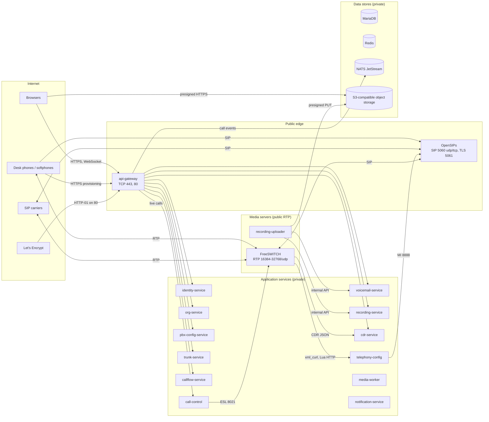

# Components

What every process in the platform does, what it listens on, what it connects to, what it keeps, and whether you may run more than one copy. Ports and variables are listed in full in [network and firewall](network-and-firewall.md) and the [configuration reference](configuration-reference.md). This page is the map.

## 1. The big picture

There are four groups.

- **The public edge** is two processes. The **API gateway** is the only HTTP entry point: the web console, the REST API, the console's live connection (WebSocket), phone provisioning and certificate challenges. **OpenSIPs** is the only SIP entry point: phones register to it, carriers send calls to it, and it hands every call to a FreeSWITCH node.
- **Media servers** run **FreeSWITCH**, which answers calls, plays prompts, bridges parties, records, runs voicemail and IVR flows, and hosts conferences and queues. Next to each FreeSWITCH runs a **recording uploader** that moves finished call recordings and voicemail messages off the server.
- **Application services** are twelve Node.js processes. They hold the configuration and business data, and they turn it into what OpenSIPs and FreeSWITCH need. None of them is meant to be reachable from outside.
- **Data stores** are MariaDB (all persistent data), Redis (live call state, locks and counters, nothing durable), NATS JetStream (events between services) and an S3-compatible object store (audio, images and exports).

## 2. Edge

### 2.1 api-gateway

| | |
|---|---|
| Source | `services/api-gateway`; image from `services/api-gateway/Dockerfile` (distroless Node 22, runs as uid 65532, no shell) |
| Listens | `HTTP_PORT` (default 8080). This listener serves HTTPS if any certificate source is configured, otherwise plain HTTP. It never serves both on one port. If `HTTP_REDIRECT_PORT` is set, it also opens a plain-HTTP listener that answers ACME HTTP-01 challenges and redirects everything else to HTTPS. |
| Serves | `/v1/*` proxied to the eight API services; `/v1/ws`, the realtime hub (a WebSocket, S5-08); `/.well-known/acme-challenge/*`; `/v1/platform/health` (master administrators only); `/healthz`, `/readyz`, `/openapi.json`; the built web console when `CONSOLE_DIR` is set. |
| Connects to | Redis (rate-limit counters, required); identity, org, pbx-config, callflow, voicemail, cdr, trunk and recording services over HTTP; org-service's internal certificate, ACME-challenge and org-lineage routes; identity-service's permission lookup and call-control's live calls (for the realtime hub); **NATS** (the realtime hub reads `call.*` events and publishes audit records; not required to start: the gateway serves the API without it and keeps retrying). |
| Stores | Nothing. It caches certificates, the login-token signing keys, org lineage and (for 5 s) permissions in memory. |
| Background work | The realtime hub: one ordered NATS consumer per process, a ping to every open WebSocket every 30 s, and a permission recheck of every subscription every 30 s. |
| Copies | Any number. Rate-limit counters live in Redis, so copies share them. Each copy reads every call event itself and serves only its own WebSockets, so live connections need no sticky sessions; the load balancer must allow WebSocket upgrades ([network §6.3](network-and-firewall.md#63-client-addresses-and-x-forwarded-headers)). |

It checks the access token on every request (EdDSA, keys published by identity-service), applies per-IP and per-user rate limits, and forwards the request with signed `x-internal-*` headers that tell the service who is calling. It forwards only `/v1/*`. The services' `/internal/v1/*` routes can never be reached through it.

The realtime hub (`/v1/ws`) streams live calls and presence to the console. Each subscription is authorized like an API request (tenant boundary and org ancestry, the reseller private-data wall, the topic's permission) and checked again every 30 seconds, and a private one (live calls) is audited. See [06 api-gateway](../architecture/06-services.md#realtime-hub-s5-08).

It believes `X-Forwarded-For` and `X-Forwarded-Proto` only from the proxies listed in `TRUSTED_PROXIES` (none by default), and signs the client address it settles on into the forwarded headers, for audit events and sessions. See [network §6.3](network-and-firewall.md#63-client-addresses-and-x-forwarded-headers).

### 2.2 OpenSIPs

| | |
|---|---|
| Source | `telephony/opensips`: `opensips.cfg.template` (rendered at start by `docker-entrypoint.sh`), `seed-dispatcher.py`, `db-schema/` |
| Image | `opensips/opensips:3.6` plus the MySQL, HTTP, Redis, presence, auth and TLS modules. Runs as root. |
| Listens | SIP UDP and TCP on `OPENSIPS_SIP_PORT` (5060) on all interfaces; SIP TLS on 5061 when TLS is on; the **management interface (MI)** over HTTP on `OPENSIPS_MI_PORT` (8888) on all interfaces, **with no authentication**. |
| Connects to | MariaDB `opensips` schema (users, domains, trunks, routes, registrations, TLS certificates); Redis (the module is loaded but nothing uses it yet); FreeSWITCH nodes on SIP 5060 (calls, plus an OPTIONS probe every 10 seconds); carriers; phones. |
| Stores | Its tables in the `opensips` schema. telephony-config writes them; OpenSIPs reads them. Registrations (`location`) and dialogs are written back. |
| Copies | **Exactly one.** There is no clustering, no dialog replication and no floating IP (plan task S4-06). telephony-config sends reload commands to a single MI address. |

What it does on each request:

1. **Flood protection (`pike`):** more than 30 requests in 2 seconds from one source IP blocks that IP for 120 seconds. FreeSWITCH nodes and addresses listed on a trunk are exempt (G-117); phones and unknown sources are not.
2. **Phones:** digest authentication against `subscriber`, registration into `location`, and presence subscriptions (BLF).
3. **Carriers:** calls from a trunk's IP addresses are recognised through the `address` table. Registration-based trunks register out through `uac_registrant`.
4. **To FreeSWITCH:** every call is sent round-robin to a FreeSWITCH node from dispatcher set 1, with the tenant (`X-Tenant-Id`), direction and trunk added as headers.
5. **From FreeSWITCH:** OpenSIPs recognises a node by source IP and port, and either delivers the call to a registered phone or routes it out to a carrier (`drouting`, with failover on 5xx and 408).
6. **Everywhere:** signalling topology is hidden. Media is not, because OpenSIPs never touches SDP.

The FreeSWITCH pool is read from `OPENSIPS_FS_DESTINATION` **only when OpenSIPs starts**. Adding or removing a node means restarting OpenSIPs.

## 3. Media servers

### 3.1 FreeSWITCH

| | |
|---|---|
| Source | `telephony/freeswitch`: `conf/` replaces the stock configuration, `scripts/` holds the Lua apps |
| Image | `safarov/freeswitch:1.10.12` plus this configuration. Runs as root. |
| Listens | SIP on `FS_SIP_PORT` (5060), bound **only to the address FreeSWITCH detects as its own** (`local_ip_v4`, the interface with the default route); RTP on UDP `FS_RTP_START_PORT`–`FS_RTP_END_PORT` (16384–32768); the **event socket (ESL)** on TCP 8021 on all interfaces. |
| Accepts | SIP only from `FS_OPENSIPS_CIDR` (the `opensips` ACL); ESL only from 127.0.0.1 and `FS_CLUSTER_CIDR`, plus the password. Both CIDRs default to 127.0.0.1/32, so a node that is not configured refuses everything. |
| Connects to | telephony-config over HTTP: every call's dialplan, directory and module configuration, call-flow definitions, prompts, voicemail and conference PINs. cdr-service over HTTP (one JSON record per call). Redis (a per-tenant concurrent-call counter). OpenSIPs (outbound legs). Never object storage: it records call recordings and voicemail messages into the spool, and the uploader moves them (S5-16). |
| Stores | Nothing durable. Call recordings and voicemail messages (`vm-<id>.wav`) are written to `/var/spool/cuc/rec` and moved off by the uploader. Prompts and flow definitions are cached in `/var/cache/cuc/http` and `/var/cache/cuc/flow`, and are safe to lose. |
| Copies | One per server. Several nodes can run on separate servers ([§6](#6-running-more-than-one-copy)). |

FreeSWITCH holds no tenant configuration. Every call asks telephony-config what to do, so any node can take any call. The exceptions are queues, parking lots and conference rooms, which live in one node's memory while they are in use.

**The address FreeSWITCH puts in SDP for audio is its own detected interface address, unless `FS_EXTERNAL_RTP_IP` sets another** (for 1:1 NAT; [network §4](network-and-firewall.md#4-media-rtp-and-why-freeswitch-needs-a-public-address)).

### 3.2 recording-uploader

| | |
|---|---|
| Source | `services/recording-service/src/uploader`; same image as recording-service, started with the command `dist/src/uploader/main.js` |
| Listens | `METRICS_PORT` (9464): `/metrics` (Prometheus) and `/healthz` |
| Connects to | recording-service's internal API for call recordings, and voicemail-service's for voicemail messages (asks for an upload URL, then reports completion); object storage (HTTP PUT to the presigned URL) |
| Stores | Nothing. It reads and deletes files in the spool directory it shares with FreeSWITCH. |
| Copies | **Exactly one per FreeSWITCH node, on the same server**, sharing the node's spool directory |

It waits until a file has stopped changing and its WAV header is closed. Then it uploads the file, has the owning service check the size and MD5 against storage, and only then deletes the local copy. It holds no database or storage credentials.

The file name says which service owns it: `<uuid>.wav` is a call recording (recording-service), `vm-<uuid>.wav` is a voicemail message `voicemail.lua` recorded (voicemail-service, S5-16). Both services answer the same three calls (`upload-url`, `complete`, `fail`), so both kinds get the same settle, verify, retry and alert behaviour, and the metrics count them together. A voicemail message is listed only once its audio is verified, so it appears about 30 seconds (`SETTLE_SECONDS`) after the caller hangs up. `VOICEMAIL_SERVICE_URL` is required: without it the uploader does not start.

## 4. Application services

Every one of these listens on `HTTP_PORT` (8080 by default), exposes `/healthz` and `/readyz`, logs JSON to stdout, and runs its own database migrations at startup. Each has its own MariaDB schema and user, and never reads another service's tables. "Relay" means the service writes events to an outbox table and publishes them to NATS ([§5](#5-data-stores)).

| Service | What it does | Stores (MariaDB schema, plus) | Talks to | Background work |
|---|---|---|---|---|
| **identity-service** | Users, passwords, two-step codes (TOTP), sessions and refresh cookies, roles and grants, invitations, password resets, the audit log. Signs access tokens and publishes the public keys at `/.well-known/jwks.json`. | `identity_service`: users, roles, grants, sessions, audit events, **login-token signing keys (encrypted with `CRYPTO_KEKS`)** | org-service; NATS | Relay; audit consumer |
| **org-service** | The master, resellers and tenants; domains and domain verification; brands and brand assets; console hostnames; network and ACME settings; **issues and renews every TLS certificate** through Let's Encrypt | `org_service`: organisations, domains, brands, certificates and private keys (encrypted), ACME account keys (encrypted); object storage: brand images | identity-service; NATS; object storage; **the internet** (Let's Encrypt, public DNS) | Relay; certificate worker (every 60 s); certificate reconcile (every 5 min) |
| **pbx-config-service** | Extensions and SIP passwords, DIDs, ring groups, queues and agents, parking lots, conference rooms, schedules, emergency locations, media assets, per-extension call handling, phones and **phone provisioning files** | `pbx_config_service` (SIP passwords encrypted); object storage: media uploads | org-service, trunk-service, identity-service; NATS | Relay; consumes `org.domain.added` |
| **trunk-service** | Carrier trunks (credentials encrypted), outbound routes, emergency routes | `trunk_service` | org-service, telephony-config, identity-service; NATS | Relay |
| **callflow-service** | IVR and auto-attendant flows: drafts, validation, versions, publishing | `callflow_service` | identity-service; NATS | Relay |
| **voicemail-service** | Mailboxes, PINs (encrypted), greetings, messages, voicemail-to-email settings | `voicemail_service`; object storage: messages and greetings | pbx-config-service, identity-service; NATS | Relay; pending-message sweep (hourly: messages whose audio never arrived are marked failed after 72 h) |
| **recording-service** | Recording rules, recording metadata, playback and download links, retention | `recording_service`; object storage: recordings | identity-service; NATS | Relay; retention sweep (hourly) |
| **cdr-service** | Receives a call record from FreeSWITCH for every call; call-record search and CSV export; billing records | `cdr_service`; object storage: exports | org-service, pbx-config-service, identity-service; NATS | Relay; export consumer |
| **telephony-config** | The bridge to the telephony layer. Keeps its own copy of what calls need (fed by events), answers every FreeSWITCH request, and writes the OpenSIPs tables. **It is the only service FreeSWITCH talks to for configuration.** | `telephony_config`, **plus read-write access to the `opensips` schema** | OpenSIPs MI; Redis; object storage (reads prompts, voicemail audio); pbx-config, trunk, org, voicemail, callflow, call-control and recording services; NATS | Relay; five consumers (org, certificates, pbx, trunk, recording settings); reconcile and certificate sync (every 15 min) |
| **call-control** | Connects to every FreeSWITCH event socket, tracks live calls and node health in Redis, and hands out the leases that pin a queue, parking lot or conference to one node | `call_control` (outbox only); Redis: calls, nodes, leases | **FreeSWITCH ESL on every node**; Redis; NATS | ESL connections; heartbeats; lease renewals; relay |
| **media-worker** | Transcodes uploaded prompts and hold music with ffmpeg. Kept apart because it handles untrusted files. | `media_worker` (outbox and consumed events only); object storage | pbx-config-service; NATS | Consumes `pbx.media_asset.finalize_requested` |
| **notification-service** | Sends every email: invitations, password resets, two-step resets, voicemail-to-email. Branded per reseller. | `notification_service` (sent-mail log) | **SMTP relay**; org-service; identity-service (issues each reset or invitation link at send time); voicemail-service; NATS | Identity and voicemail consumers |

media-worker and notification-service serve only their health endpoints. None of their routes is called by anything else.

The folders `analytics-service`, `chat-service`, `fax-service`, `provisioning-service` and `sms-service` are empty placeholders. Nothing runs from them. `example-service` is a code template, not part of a deployment.

## 5. Data stores

| Store | Version used | Used by | Holds | Durable? |
|---|---|---|---|---|
| **MariaDB** | 11.4 (the only version tested) | Every service except api-gateway; OpenSIPs | 13 service schemas plus `opensips`. **This is the system of record.** | Yes: back it up |
| **Redis** | 7 | api-gateway (rate limits), call-control (live calls, node health, leases), telephony-config (ring-group rotation, reads leases), FreeSWITCH (concurrent-call counter), OpenSIPs (loaded, unused) | Only live and short-lived state. If it is flushed or restarted, node health reappears at the next heartbeat (3 s) and rate-limit counters start again. Tracking for calls in progress and their resource leases is lost; rebuilding it is plan task S4-04, not built. | No |
| **NATS JetStream** | 2.10 | Every service that publishes or consumes events; api-gateway (reads call events with an ephemeral consumer) | Events between services. Streams are created by the services at start (limits retention, discard old, 2-minute duplicate window). | Yes, on its data directory. Losing it loses only undelivered events; the outbox tables keep anything not yet published. |
| **Object storage** | Any S3-compatible service (MinIO in development) | org, pbx-config, voicemail, recording, cdr, telephony-config, media-worker services; the uploader (through presigned URLs); browsers (presigned URLs) | Recordings, voicemail, prompts and hold music, brand images, CSV exports | Yes: back it up or use a provider that replicates |

Object storage layout: by default one bucket per tenant, named `{STORAGE_BUCKET_PREFIX}-t-{tenant id without hyphens}`, plus `{prefix}-platform` for brand assets. Set `STORAGE_MODE=prefix-per-tenant` if your provider limits the number of buckets. That puts every tenant in `{prefix}-shared` under a `t-{id}/` prefix. Services create buckets when they first need them, and try (but do not require) server-side encryption and a public-access block.

## 6. Running more than one copy

What the code allows today. "Safe" means the code guards against two copies doing the same work.

| Component | More than one copy? | Why |
|---|---|---|
| api-gateway | **Safe** | Stateless; rate limits in Redis. Each copy's realtime hub reads every event and serves its own WebSockets; connection limits are per copy. |
| identity, org, pbx-config, trunk, callflow, voicemail, cdr services | **Safe** | Stateless HTTP; the relay claims outbox rows with `FOR UPDATE SKIP LOCKED`; consumers share one durable consumer per service and deduplicate by event id; migrations take a lock. org-service's certificate worker leases each job. |
| recording-service | **Works, with duplicated work** | The hourly retention sweep has no lock, so every copy runs it. Deleting an object twice is harmless. Not tested. |
| telephony-config | **Works, with duplicated work** | The reconcile and certificate-sync timers run in every copy with no lock. The work is idempotent. Not tested. |
| media-worker, notification-service | **Safe** | Consumers only |
| **call-control** | **No: run exactly one** | Every copy connects to every FreeSWITCH node and would publish every call event twice. Nothing hands nodes out between copies (plan task S4-03). |
| **OpenSIPs** | **No: run exactly one** | No clustering (S4-06); telephony-config reloads one MI address |
| FreeSWITCH | One per server; **several servers work for plain calls** | Round-robin dispatch is verified with two nodes. But OpenSIPs does not yet send a call to the node that already holds a queue, parking lot or conference (G-46, plan task S4-05). With two or more nodes, a call to a queue, parking slot or conference room that is already active on another node can fail. **Use one FreeSWITCH node if those features matter**, until S4-05 is built. |
| recording-uploader | One per FreeSWITCH node | It shares that node's spool |
| MariaDB, Redis, NATS | **One each** | No clustering is configured or tested (S4-07). Replication is possible with the products' own tools, but the platform has no support for failover. |

Nothing detects a failed FreeSWITCH node and cleans up its calls (S4-04). OpenSIPs stops sending new calls to a node that stops answering its OPTIONS probe. Calls in progress on a node that dies are lost, and so are recordings not yet uploaded (decision O-13, accepted).

## 7. Startup order and dependencies

A service runs its migrations and connects to NATS before it listens, so it exits if MariaDB or NATS is not reachable yet. With a restart policy (`restart: unless-stopped` or systemd `Restart=always`) it comes back once they are. The platform comes up cleanest in this order:

1. MariaDB (with the schemas and users created, see [all-in-one §5](deploy-all-in-one.md#5-prepare-mariadb)), Redis, NATS, object storage.
2. org-service, identity-service.
3. pbx-config-service, trunk-service, callflow-service, voicemail-service, recording-service, cdr-service, media-worker, notification-service.
4. call-control, then telephony-config.
5. OpenSIPs (needs the `opensips` schema to exist), FreeSWITCH nodes, recording uploaders.
6. api-gateway. Its realtime hub waits for NATS in the background, so the gateway starts without it; live subscriptions are refused as unavailable until NATS and the `CALL` stream (created by call-control) are there.

telephony-config starts without recording-service: if it cannot get a recording decision, it places the call unrecorded and flags it.
