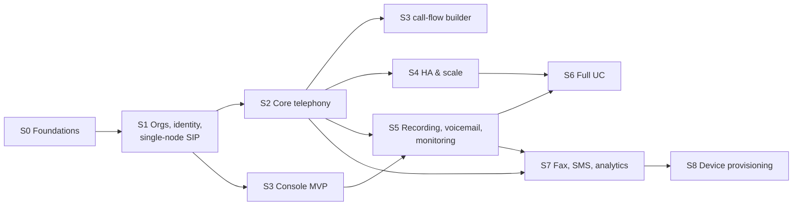

# Staged implementation plan

This plan turns SAD §11 into **stages** of discrete tasks. Each task is sized to be roughly one pull request, which makes it suitable to hand to an implementer such as Claude Code as a single unit.

## How to use this plan

- A task ID (`S2-07`) is stable. Reference it in branch names (`s2-07-flow-runner`) and PR titles.
- **Depends on** lists tasks that must be merged first. Tasks with no unmet dependencies can run in parallel.
- **Done when** lists acceptance criteria. A task isn't done until they pass in CI.
- Every task implicitly includes: tests at the levels in [09 §3](../architecture/09-engineering-conventions.md#3-testing-strategy), updated OpenAPI and event schemas, and no brand-leak violations.
- Decisions marked *Proposed* in [decisions.md](../decisions.md) must be signed off before the first task that depends on them starts.

## Changes from SAD §11

| Change | Why |
|---|---|
| New **Stage 0** (engineering foundations) | Shared libraries, the tenancy guardrails, and the brand-leak guard have to exist before feature work, or every service invents its own |
| Voicemail **storage** moved from Phase 5 to Stage 2 (D-015) | The storage design determines whether FS nodes are stateless. Email and transcription stay in Stage 5. |
| Affinity abstraction built in Stage 2, exercised multi-node in Stage 4 | Queues, parking, and conferences must be written against the lease abstraction from the start, or Stage 4 becomes a rewrite |
| The local dev stack runs **two FS nodes from Stage 2** | Catches accidental node-local state early |
| Toll-fraud limits and emergency calling baseline added to Stage 2 | Needed before any real trunk carries traffic (G-1, G-6) |
| notification-service added in Stage 3 | Password reset and invitations need email before the console ships |

## Stage map

Stage 3's non-telephony screens can start as soon as Stage 1 lands, in parallel with Stage 2.

### Milestones

| Milestone | Reached at end of | Meaning |
|---|---|---|
| **M1 — Dial tone** | S1 | Two phones in one tenant can call each other, and cross-tenant isolation is proven |
| **M2 — Pilot PBX** | S2 + S3 | A reseller can onboard a tenant through the console, connect a real trunk, and take calls through an auto attendant, ring group, queue, and voicemail. CDRs are exportable. |
| **M3 — Production-ready voice** | S4 + S5 | Multi-node active-active with tested failover, plus recording, voicemail-to-email, and supervisor monitoring |
| **M4 — Full UC** | S6 + S7 | Video, chat, fax, SMS, and analytics |

---

## Stage 0 — Engineering foundations

**Goal:** a monorepo in which a new service can be created, tested, and shipped with tenancy, authorization, events, and brand guardrails built in.

| ID | Task | Depends on |
|---|---|---|
| S0-01 | Monorepo scaffold | — |
| S0-02 | `@cuc/config`, `@cuc/logger`, `@cuc/http` | S0-01 |
| S0-03 | `@cuc/db` with tenant scoping | S0-01 |
| S0-04 | `@cuc/events` with outbox | S0-03 |
| S0-05 | Local dev stack (compose) | S0-01 |
| S0-06 | CI pipeline | S0-01 |
| S0-07 | Brand-leak guard | S0-06 |
| S0-08 | Service template + example service | S0-02, S0-03, S0-04 |
| S0-09 | `@cuc/crypto` envelope encryption | S0-01 |
| S0-10 | `@cuc/storage` S3 abstraction | S0-05 |

**S0-01 Monorepo scaffold.** pnpm workspaces, Turborepo, a shared `tsconfig` base, ESLint (flat config) + Prettier, Vitest workspace, the directory layout from [01 §5](../architecture/01-system-overview.md#5-monorepo-layout), `.editorconfig`, and `.nvmrc` (Node 22).
*Done when:* `pnpm lint typecheck test build` passes on an empty `packages/example`.

**S0-02 Core runtime packages.**
- `@cuc/config`: environment variables validated by schema; fails fast on invalid config.
- `@cuc/logger`: pino with redaction of secret paths.
- `@cuc/http`: a Fastify factory with health and readiness routes, OpenAPI generation, problem+json errors, request ID/trace propagation, and a request-context decorator. Route options require `permission` and `dataClass`, so registration fails without them.

*Done when:* a sample route without `dataClass` fails at registration, and a test verifies that no `Server` or `X-Powered-By` header is emitted.

**S0-03 `@cuc/db`.** Kysely + mysql2 for MariaDB, a migration runner CLI, `scoped(ctx)` and `unscoped(ctx, reason)` helpers, a lint rule forbidding raw SQL outside `migrations/` and `@cuc/db`, and Testcontainers helpers in `@cuc/testing`.
*Done when:* the cross-tenant probe test harness exists and fails if a repository omits scoping (demonstrated with a deliberately broken fixture).

**S0-04 `@cuc/events`.** NATS JetStream client, the envelope type ([05 §5](../architecture/05-data-architecture.md#5-events)), the `outbox` table migration template, the relay worker, a consumer helper with durable name + dedupe by `id`, and event schema registration in `@cuc/api-contracts`.
*Done when:* an integration test shows at-least-once delivery with no duplicates reaching the handler after a relay crash and restart.

**S0-05 Local dev stack.** `infra/compose` with MariaDB 11.4, Redis, NATS (JetStream), MinIO, and Mailpit, plus `make up` / `make down` / `make reset` and seed scripts. Telephony containers are added in S1.
*Done when:* `make up` brings everything up healthy in under 60 s on a laptop.

**S0-06 CI pipeline.** GitHub Actions: install, then affected `lint`/`typecheck`/`test`/`build`, then the integration tests with service containers. Caches pnpm and Turbo.
*Done when:* CI is green on `main`, and a PR with a failing test is blocked.

**S0-07 Brand-leak guard.** `tools/brand-leak`: a configurable deny-list (codebase name variants, the operator's company name, Flutter template strings) and an allow-list of code-only paths. It scans source files under user-facing directories (`apps/console/web`, `apps/console/lib`, email templates, telephony config templates) and built artifacts. Runs in CI.
*Done when:* adding "ConductorUC" to `apps/console/web/index.html` fails CI.

**S0-08 Service template.** `pnpm gen:service <name>` creates the layout from [09 §1](../architecture/09-engineering-conventions.md#1-typescript-services), including a Dockerfile (distroless, non-root), health routes, a migration folder, and a sample test. It also generates `services/example-service`.
*Done when:* the generated service builds, runs in compose, and passes its tests.

**S0-09 `@cuc/crypto`.** Envelope encryption: a KEK provider interface (a file key for dev, Vault Transit adapter stub) with data keys and key version tags.
*Done when:* round-trip and rotation tests pass.

**S0-10 `@cuc/storage`.** Wraps the S3 client. Supports bucket-per-tenant and prefix-per-tenant modes, presigned GET/PUT with a maximum TTL, bucket provisioning with encryption and a public-access block, and lifecycle rule helpers.
*Done when:* integration tests pass against MinIO in both modes.

**Stage 0 exit:** a new service generated from the template gets tenancy scoping, authorization metadata enforcement, the outbox, and the brand-leak check without extra work.

---

## Stage 1 — Orgs, identity, single-node telephony (M1)

**Goal:** master → reseller → tenant exists via API, users can log in, and two phones in one tenant can call each other through OpenSIPs and one FreeSWITCH node.

| ID | Task | Depends on |
|---|---|---|
| S1-01 | org-service: schema + hierarchy invariants | S0-08 |
| S1-02 | org-service: provisioning API + events | S1-01, S1-05 |
| S1-03 | org-service: domains | S1-02 |
| S1-04 | org-service: brands + public brand resolution | S1-02, S0-10 |
| S1-05 | identity-service: users, login, tokens | S0-08, S0-09 |
| S1-06 | `@cuc/authz` + roles/grants + hard rules | S1-05 |
| S1-07 | `@cuc/audit` + audit store | S1-05, S0-04 |
| S1-08 | api-gateway | S1-05, S1-06 |
| S1-09 | pbx-config-service: extensions + SIP credentials | S1-06, S0-09 |
| S1-10 | FreeSWITCH base image & bootstrap config | S0-05 |
| S1-11 | OpenSIPs base image & config | S0-05 |
| S1-12 | telephony-config: read model + OpenSIPs projection | S1-03, S1-09, S1-11 |
| S1-13 | telephony-config: xml_curl directory + dialplan (ext→ext) | S1-12, S1-10 |
| S1-14 | SIP test harness + M1 scenarios | S1-13 |
| S1-15 | Read permissions: a `.read` twin for every `.manage`, `.manage` implies `.read`, support roles fixed, console read-only screens (G-10) | S1-06 |

**S1-01 org-service schema.** The `orgs`, `tenant_domains`, `reseller_base_domains`, and `brands` tables. The single-master constraint and parent-type rules. A bootstrap CLI `org-service bootstrap-master` creates the master org and its first admin user. That admin user is created through identity-service's internal API, which is stubbed until S1-05.
*Done when:* invariant tests reject a tenant under master, a reseller under reseller, and a second master.

**S1-02 Provisioning API.** The reseller and tenant CRUD, suspend, and resume endpoints from [06](../architecture/06-services.md#org-service). Creating an org creates its first admin user via identity-service. Emits `org.*` events.
*Done when:* master can create a reseller, a reseller can create a tenant, and a reseller cannot see another reseller's tenants (tenancy test). A tenant admin cannot create orgs.

**S1-03 Domains.** Assign a primary tenant domain (`{slug}.{base}`), register a reseller base domain with TXT verification, and enforce global uniqueness.
*Done when:* domain events fire, and a verification flow test using a mocked DNS resolver passes.

**S1-04 Brands.** Reseller brand CRUD, brand asset upload through presigned PUT, WCAG AA contrast validation of color pairs, console hostname registration, and `GET /v1/public/brand?host=`. **Neutral** is returned for the master hostname, unknown hosts, and resellers without a brand.
*Done when:* tests cover all four resolution branches, and the neutral response contains no product name.

**S1-05 identity-service core.** Users, argon2id hashing, login, refresh rotation with reuse detection, logout, JWKS, and TOTP MFA (required for master and reseller users). Includes the internal endpoint for creating an org's first admin.
*Done when:* a refresh-token reuse test revokes the family, and a master user without MFA cannot obtain an access token beyond MFA enrollment.

**S1-06 Authorization.** `@cuc/authz` implements the evaluation in [07 §3](../architecture/07-security-and-permissions.md#3-authorization): ancestry, roles, grants, and hard rules H1–H4. Adds the built-in roles and the permission catalog, plus the roles/grants API.
*Done when:* a generated **matrix test** covering every (org type × permission × data class) combination matches the SAD §3 table. H1 cannot be overridden by any grant.

**S1-07 Audit.** The `@cuc/audit` publisher, the identity-service `AUDIT` consumer, the `audit_events` table (monthly partitions), and the query API with visibility rules.
*Done when:* master reading a tenant-private resource produces an audit row visible to that tenant.

**S1-08 api-gateway.** JWT verification, API-key auth, the signed internal request-context header, routing table config, rate limiting, CORS from `console_hostnames`, and the unauthenticated public routes (brand, login).
*Done when:* a forged or unsigned context header is rejected by services, and rate-limit tests pass.

**S1-09 pbx-config extensions.** Extension CRUD, SIP credential generation (encrypted secret, HA1/HA1b), a `:reveal` action that is audited, numbering validation, and `pbx.extension.*` events.
*Done when:* the SIP secret never appears in any list or get response, and HA1 recomputes when the tenant domain changes (test).

**S1-10 FreeSWITCH image.** `telephony/freeswitch`: a minimal module set; a single `internal` profile that accepts only OpenSIPs (ACL); xml_curl bindings; event socket on a private interface; and **neutral** `user-agent-string`, SDP `username`, and session name. A tmpfs spool dir is prepared for later stages.
*Done when:* the container starts in compose, the brand-leak scan of the rendered config passes, and a SIP OPTIONS response shows a neutral User-Agent.

**S1-11 OpenSIPs image.** `telephony/opensips`: templated `opensips.cfg` with registrar, auth_db, multi-domain, a dispatcher to the FS set, topology_hiding, nathelper, pike, header sanitation of `X-Tenant-*`, and neutral `server_header`/`user_agent_header`. Includes the `opensips` schema migrations.
*Done when:* the container starts, reads the (empty) projection, and responds to OPTIONS with a neutral Server header.

**S1-12 telephony-config projection.** Consumes org, domain, and extension events into a local read model, projects `domain` and `subscriber` into the `opensips` schema, triggers MI reloads, and runs a reconciliation job.
*Done when:* creating an extension makes a REGISTER succeed within 5 s, and suspending a tenant makes its REGISTERs fail within 5 s.

**S1-13 xml_curl directory + dialplan.** `/fs/directory` and `/fs/dialplan` for the `from-ext` context: extension-to-extension dialing within the tenant (routed back through OpenSIPs for location), and calls to unknown numbers rejected. Adds the caching headers and the p99 latency metric.
*Done when:* a latency benchmark shows p99 < 20 ms at 200 req/s.

**S1-14 SIP harness + M1.** A `tests/sip` runner that drives SIPp scenarios against compose. Scenarios:
- Register 101 and 102 in tenant A, then 101 calls 102 (answered, BYE).
- 101 in tenant A dials tenant B's extension number and does **not** reach tenant B.
- A spoofed `X-Tenant-Id` from a phone is stripped.
- A suspended tenant cannot register.

*Done when:* all scenarios pass in CI (smoke job).

**Stage 1 exit = M1.**

---

## Stage 2 — Core telephony (M2 backend)

**Goal:** real trunks, DIDs, auto attendants, ring and hunt groups, queues, parking, basic conferences, voicemail with central storage, BLF, CDR export, fraud limits, and an emergency baseline, all node-agnostic.

| ID | Task | Depends on |
|---|---|---|
| S2-01 | trunk-service: trunks, IPs, credentials | S1-06, S0-09 |
| S2-02 | Trunk projection to OpenSIPs (drouting, registrant, address, uac_auth) | S2-01, S1-12 |
| S2-03 | DIDs + inbound routing | S2-02, S1-09 |
| S2-04 | Outbound routes + number normalization | S2-02 |
| S2-05 | Toll-fraud controls | S2-04 |
| S2-06 | Emergency calling baseline (scope per G-1) | S2-04 |
| S2-07 | Media assets | S0-10, S1-09 |
| S2-08 | Ring groups & hunt groups | S2-03 |
| S2-09 | `@cuc/callflow-ir` + callflow-service backend | S1-06 |
| S2-10 | `flow_runner.lua` + dialplan integration (auto attendant) | S2-09, S2-07, S2-08 |
| S2-11 | call-control v0: ESL, events, Redis registry | S1-10, S0-04 |
| S2-12 | Affinity lease abstraction | S2-11 |
| S2-13 | Queues (mod_callcenter) | S2-12, S2-07 |
| S2-14 | Call parking | S2-12 |
| S2-15 | Audio conference rooms | S2-12 |
| S2-16 | Voicemail core (Lua app + voicemail-service storage + MWI) | S2-07, S1-12 |
| S2-17 | BLF / presence | S1-11 |
| S2-18 | cdr-service: ingest + CDR v1 + export API | S2-11 |
| S2-19 | Second FS node in dev stack + node-agnostic test pass | S2-10, S2-13, S2-16 |
| S2-20 | M2 backend SIP regression suite | all above |

**S2-01 trunk-service.** Trunk CRUD (register, IP, or both auth modes), encrypted credentials, trunk IPs, codec preferences, `max_channels`, and caller-ID policy. Resellers can manage their tenants' trunks. Tenant admins can view them, and edit them with the `trunk.manage` grant.
*Done when:* credentials are never returned, and the H1/tenancy tests pass.

**S2-02 Trunk edge projection.** telephony-config projects trunks into `registrant` (clustered), `address` (IP auth), `dr_gateways`/`dr_rules`/`dr_groups` (one group per tenant), and credentials for `uac_auth`. Adds a trunk status internal API that reads registrant state via MI.
*Done when:* a SIPp "carrier" registrar accepts a registration from the platform, and trunk status shows `registered`.

**S2-03 DIDs + inbound routing.** DID CRUD (E.164, globally unique, bound to a trunk) with destinations: extension, ring group, flow, queue, conference, voicemail. OpenSIPs identifies the trunk and tenant and sets the headers. The `from-trunk` dialplan resolves the destination.
*Done when:* a SIPp carrier INVITE to a DID rings the right extension, an INVITE from an unknown IP is rejected, and a DID owned by tenant B that arrives on tenant A's trunk is rejected.

**S2-04 Outbound routing.** Per-tenant outbound routes (pattern, strip, prepend, ordered trunks), E.164 normalization by tenant country, and failover to the next trunk on 5xx or timeout. Caller ID comes from the extension, DID, or trunk policy.
*Done when:* SIPp confirms failover to the secondary trunk on 503.

**S2-05 Fraud controls.** Per-tenant concurrent channel and CPS limits (OpenSIPs `ratelimit` + FS `limit` with a Redis backend), international calling off by default, country allow-lists, and an anomaly alert event.
*Done when:* SIPp shows call N+1 over the channel limit rejected, and an international call rejected by default.

**S2-06 Emergency baseline.** Needs the G-1 scope decision. Covers direct dial with no prefix, a priority emergency route, an emergency location per extension, a notification event, and location delivery per the configured carrier method.
*Done when:* an emergency number reaches the emergency trunk even when the tenant is at its channel limit, and a notification event is emitted.

**S2-07 Media assets.** Upload via presigned PUT, then a finalize step that transcodes with `ffmpeg` to 8 kHz and 16 kHz mono WAV, stores the files in the tenant bucket, and records the metadata. The FS playback URL resolver works through `http_cache` (a signed, short-lived URL resolved by telephony-config).
*Done when:* an uploaded MP3 plays on a call (SIPp with an RTP check or FS playback event), and a node restart simply re-caches.

**S2-08 Ring and hunt groups.** Strategies: simultaneous, sequential, round-robin (the counter lives in Redis, not on the node), and random. Adds the ring timeout and the no-answer destination.
*Done when:* SIPp scenarios verify each strategy's order.

**S2-09 Call-flow IR + service.** `@cuc/callflow-ir` provides the JSON Schema for the graph and the IR, the compiler, and the validator (unreachable nodes, missing ports, bad references, digit conflicts). callflow-service adds flows, drafts, `:validate`, `:publish` (immutable), `:rollback`, entry points, the internal IR endpoint, and the `callflow.flow.published` event.
*Done when:* compiler tests cover all MVP node types, and a published version cannot be modified.

**S2-10 Flow runner.** `telephony/freeswitch/scripts/flow_runner.lua`: fetches the IR (mod_curl), caches it on disk by version, and implements the MVP nodes (`play`, `menu`, `time_condition`, `extension`, `ring_group`, `queue`, `voicemail`, `goto_flow`, `hangup`), plus the loop guard. The dialplan hands off DIDs and entry points to the runner.
*Done when:* SIPp with DTMF walks a two-level auto attendant, the loop guard triggers, and a published new version takes effect on the next call.

**S2-11 call-control v0.** ESL client per node with reconnect, event normalization and publishing (`call.channel.*`), the Redis call registry ([04 §3.2](../architecture/04-high-availability.md#32-call-ownership)), and the node heartbeat keys.
*Done when:* the Redis registry reflects SIPp calls accurately under 50 concurrent calls, and entries are cleaned on hangup.

**S2-12 Affinity abstraction.** Lease acquire, renew, and release ([04 §3.3](../architecture/04-high-availability.md#33-resource-affinity-leases)). telephony-config's `configuration` binding serves only the resources leased to the requesting node. Adds the flow-runner "hairpin" transfer when a resource is leased elsewhere.
*Done when:* unit and integration tests pass on one node. Stage 4 tests it multi-node.

**S2-13 Queues.** Queue, agent, and tier config in pbx-config; the callcenter config via xml_curl; agent login and logout feature codes; MOH; position announcements; and `call.queue.*` events.
*Done when:* SIPp shows callers queued and distributed to agents by strategy, and agent logout removes the agent from distribution.

**S2-14 Call parking.** Parking lots with slot ranges on `mod_valet_parking` under affinity. Park by transfer to a slot, retrieve from any phone, and return-on-timeout.
*Done when:* SIPp can park on one call and retrieve on another.

**S2-15 Audio conferences.** Rooms with a PIN (encrypted) and a max member count, plus the `mod_conference` profile via xml_curl, under affinity.
*Done when:* three SIPp participants join, and a wrong PIN is rejected.

**S2-16 Voicemail core.** voicemail-service provides mailboxes, the PIN, greetings, and message metadata. A Lua voicemail app handles leave-message (record to spool, then upload to S3, then complete), the retrieval menu (listen, delete, save, greeting record) with playback through `http_cache` presigned URLs, and MWI through OpenSIPs presence.
*Done when:* SIPp leaves a message via node A and retrieves it via node B once S2-19 exists (on one node until then). The MWI NOTIFY reaches the subscribed phone.

**S2-17 BLF / presence.** OpenSIPs `presence` + `pua_dialoginfo` for extension BLF. Park-slot state is published by FS.
*Done when:* SIPp SUBSCRIBE receives dialog-info NOTIFYs for early, confirmed, and terminated states.

**S2-18 CDR service.** Ingest from `mod_json_cdr` (FS config added; shared token; retries), normalization to CDR v1 (freeze the schema after review, O-2), idempotent dedupe, monthly partitions, the list, get, and async CSV export API, and `cdr.record.created`. The billing view is built in this task **once D-013 is decided**.
*Done when:* every SIPp call in the regression suite produces exactly one CDR with the correct disposition and billable seconds. Resellers get 403 on the CDR endpoints.

**S2-19 Two-node dev stack.** Adds `freeswitch-2` to compose with the dispatcher set to two nodes, and runs the whole SIP suite with round-robin dispatch.
*Done when:* the full S2 suite passes with calls spread across both nodes. This proves no node-local state.

**S2-20 Regression suite.** Consolidates the SIPp scenarios for every S2 feature into a nightly full run and a per-PR smoke subset.

**Stage 2 exit:** everything in M2 works via the API and SIP. The console follows in Stage 3.

---

## Stage 3 — Console MVP (M2 frontend)

**Goal:** resellers and tenants self-serve through a branded (or neutral) console, including the call-flow builder.

| ID | Task | Depends on |
|---|---|---|
| S3-01 | Flutter app scaffold + CI + generated API client | S1-08 |
| S3-02 | Brand bootstrap, theming, neutral assets | S3-01, S1-04 |
| S3-03 | notification-service (email, brand-aware templates) | S1-04, S0-04 |
| S3-04 | Auth screens (login, MFA, reset, invitation) | S3-02, S3-03 |
| S3-05 | App shell, role-based navigation, act-as-descendant | S3-04 |
| S3-06 | Master screens: resellers | S3-05 |
| S3-07 | Reseller screens: tenants, domains, brand editor, trunks | S3-05, S2-01 |
| S3-08 | Tenant screens: users, extensions, DIDs, groups, queues, schedules, media | S3-05, S2-08, S2-13 |
| S3-09 | Call-flow builder: canvas engine | S3-01 |
| S3-10 | Call-flow builder: MVP nodes, properties, validation, publish | S3-09, S2-09 |
| S3-11 | Console E2E suite + M2 walkthrough | all above |

**S3-01 Scaffold.** `apps/console` as a Flutter web-only app. go_router, Riverpod, the generated `console_api` package, a CI job (`flutter analyze`, `flutter test`, `flutter build web`), and neutral `web/index.html` and `manifest.json`.
*Done when:* the brand-leak scan passes on `build/web`.

**S3-02 Theming.** The pre-`runApp` brand fetch, ThemeData from brand or neutral, title and favicon swap, a brand-agnostic widget library, and a re-theme after login.
*Done when:* golden tests pass for neutral and for a sample reseller brand, and the master hostname renders without any product label or logo.

**S3-03 notification-service.** SMTP relay client and MJML/Handlebars templates rendered with a resolved brand or NEUTRAL. Templates: invitation, password reset, and MFA reset. The sender identity comes from the brand's verified address or `PLATFORM_NOREPLY_ADDRESS`.
*Done when:* Mailpit tests assert that brand-A emails show brand A, master emails show no branding, and the brand-leak scan covers the templates.

**S3-04 Auth screens.** Login, MFA enroll and verify, password reset, and accept invitation. Refresh cookie handling and silent refresh.
*Done when:* integration tests cover the full login and MFA flows on the web build.

**S3-05 Shell.** Role-based navigation ([08 §3](../architecture/08-console.md#3-navigation-by-role)), a permission-aware UI helper, the act-as-descendant banner, and error and forbidden pages.
*Done when:* a reseller user never sees private-data navigation entries, and direct URL access shows the forbidden page (the server also returns 403).

**S3-06 to S3-08 CRUD screens.** List, detail, create, and edit screens for each resource, with server-side validation messages, optimistic-concurrency conflict handling (ETag), and empty states. Each resource is one PR.
*Done when:* each screen has widget tests plus one E2E path.

**S3-09 Canvas engine.** Pan and zoom viewport, grid, node widgets in a positioned stack, Bézier edges with hit testing, port dragging to connect, selection (click, shift, marquee), move with snap, delete, copy and paste, and an undo/redo command stack. Generic, with no telephony types.
*Done when:* 150 nodes pan and zoom at 60 fps in Chrome (profile trace attached to the PR), and the interaction tests pass.

**S3-10 Builder MVP.** Palette of MVP nodes, a typed properties panel per node type (pickers for extensions, groups, queues, media, and schedules), local validation badges, draft autosave, publish with diff summary, version history, and rollback. Dart types are generated from the IR JSON Schema.
*Done when:* a flow built in the UI and published is executed by the S2-10 runner in an E2E test (console → publish → SIPp call walks the menu).

**S3-11 M2 walkthrough.** A scripted E2E covering the whole pilot journey:
1. Master creates a reseller.
2. The reseller brands the console and creates a tenant.
3. The reseller adds a trunk.
4. The tenant admin creates extensions, a DID, and a flow.
5. A SIPp carrier call traverses the flow into voicemail.
6. A CDR is exported.

**Stage 3 exit = M2.**

---

## Stage 4 — HA & scale

**Goal:** active-active FreeSWITCH with measured, tested failover; HA for every stateful platform component; and the production deployment topology.

| ID | Task | Depends on |
|---|---|---|
| S4-01 | Orchestrator ADR + production topology doc (O-1) | — |
| S4-02 | Multi-node FS: dispatcher probing, weights, draining | S2-19 |
| S4-03 | call-control HA: node-assignment leases across replicas | S2-11 |
| S4-04 | Failover handling: dialog teardown, `call.lost`, synthetic CDRs, lease release, Redis rebuild | S4-02, S4-03, S2-18 |
| S4-05 | Affinity routing at OpenSIPs (`cachedb_redis`) + multi-node lease tests | S2-12, S4-02 |
| S4-06 | OpenSIPs cluster: clusterer, usrloc full-sharing, dialog replication, registrant sharing, VIP | S1-11 |
| S4-07 | Redis Sentinel, MariaDB HA, NATS cluster | S4-01 |
| S4-08 | Chaos test suite | S4-04, S4-05, S4-06 |
| S4-09 | Capacity benchmarks per node + sizing guide | S4-02 |
| S4-10 | Media anchoring decision (O-7), and RTPengine integration if accepted | S4-06 |
| S4-11 | Production deployment manifests | S4-01, S4-07 |

Key acceptance criteria:

- **S4-04:**
  - Killing FS node B during 200 concurrent SIPp calls terminates B's calls cleanly (BYE sent to both parties) within 10 s.
  - Every lost call gets a CDR with `disposition=node_failure`.
  - Node A's calls are unaffected.
  - Redis flush followed by rebuild restores the registry within 30 s.
- **S4-05:** a queue with waiting callers on node A keeps receiving new callers on node A. After A dies, the next caller re-leases the queue on node C.
- **S4-06:** killing the active OpenSIPs keeps established calls up. Phones stay registered without re-REGISTER, and new calls succeed after VIP failover.
- **S4-08:** a nightly chaos job with SIPp load runs these kills: an FS node, an OpenSIPs node, a telephony-config replica, a call-control replica, the Redis primary, and a MariaDB node. Each run records the measured detection and recovery times against targets ([04 §4](../architecture/04-high-availability.md#4-failover-sequence)).
- **S4-09:** the concurrent-call ceiling per vCPU is measured for G.711 bridged, G.711 recorded, Opus↔G.711 transcoded, and audio conference participants. Results are published in `docs/operations/sizing.md`.

---

## Stage 5 — Recording, voicemail features, monitoring (M3)

| ID | Task | Depends on |
|---|---|---|
| S5-01 | recording-service: policies (tenant, extension, agent, queue, DID, direction) + evaluate API | S1-06 |
| S5-02 | Recording decision in dialplan + consent announcement | S5-01, S1-13 |
| S5-03 | Node uploader sidecar (spool → presigned PUT → verify → delete, retries, alerting) | S5-01, S0-10 |
| S5-04 | Recording search, playback/download URLs, delete, audit | S5-03 |
| S5-05 | Retention policies → S3 lifecycle + DB cleanup | S5-04 |
| S5-06 | Transcription provider ADR (O-3) + adapter + per-mailbox toggle | S2-16 |
| S5-07 | Voicemail-to-email (attachment, brand-aware) | S2-16, S3-03 |
| S5-08 | WebSocket hub in api-gateway + permission-filtered topics | S2-11, S1-08 |
| S5-09 | Monitor actions: listen/whisper/barge via call-control on the owning node | S2-11, S1-06 |
| S5-10 | Console: recordings, voicemail settings/messages, presence board, live calls + monitor actions | S5-04, S5-07, S5-08, S5-09 |
| S5-11 | Recording for calls through IVR flows: tenant and DID rules at flow entry; extension, ring-group and queue rules at the flow's hand-off (G-111) | S5-02 |
| S5-12 | Per-tenant "recording required" option: refuse the call when a required recording cannot be set up, working while recording-service is down (G-111) | S5-02 |
| S5-13 | On-demand recording and pause/resume by feature code; per-rule "allow on demand" flag; audited (G-111) | S5-02 |
| S5-14 | Agent-scoped recording rules for queue calls, started when the agent answers (G-111) | S5-02, S2-13 |
| S5-15 | Console and self-service record, stop and pause buttons for live calls (G-111) | S5-08, S5-13 |
| S5-16 | Voicemail audio really reaches storage: the node uploader also uploads voicemail messages; completion verifies the stored object (G-2, G-107) | S5-03 |

Key acceptance criteria:

- **S5-02/S5-03:**
  - A call from an extension with recording enabled produces an object in the tenant bucket, and no file remains on the node spool afterwards.
  - An extension with recording disabled produces no recording.
  - The consent prompt plays before recording starts.
- **S5-04:**
  - A reseller admin gets 403 on every recording endpoint, even with any grant (H1).
  - A supervisor with `recording.listen` on `queue:Q1` can play Q1 calls only.
  - Every URL issuance is audited.
- **S5-09:**
  - A supervisor with `monitor.whisper` on queue Q1 can whisper to a Q1 agent's call on node B while their own phone is registered through OpenSIPs.
  - The same supervisor gets 403 on a non-Q1 call.
  - Every action is audited.

**Stage 5 exit = M3** (together with Stage 4).

---

## Stage 6 — Full UC

| ID | Task | Depends on |
|---|---|---|
| S6-01 | Video conference rooms: `mod_conference` video mux, codecs (VP8/H.264), layouts, bandwidth caps, affinity | S2-15, S4-05 |
| S6-02 | Video capacity benchmarks + per-node video session limits | S6-01 |
| S6-03 | XMPP server ADR (O-4) + deployment (vhost per tenant, MariaDB storage, clustering) | S4-01 |
| S6-04 | chat-service: vhost lifecycle from org events, auth integration, roster/room sync, MAM retention | S6-03, S1-05 |
| S6-05 | XMPP brand-neutral identity (disco/version responses) + brand-leak coverage | S6-03 |
| S6-06 | Console: chat admin (rooms, retention), video room management | S6-01, S6-04 |
| S6-07 | Optional SIP→XMPP presence bridge (O-15) | S6-04, S2-11 |

Key acceptance criteria:
- **S6-01:** three SIP video endpoints join a room and see a mux layout.
- **S6-04:**
  - A user in tenant A cannot discover or message users in tenant B.
  - Chat archives are tenant-private (H1).
  - A disabled identity user is disconnected from XMPP within 60 s.

---

## Stage 7 — Extended features (M4)

| ID | Task | Depends on |
|---|---|---|
| S7-01 | fax-service inbound: T.38 via `mod_spandsp`, TIFF→PDF, tenant bucket, fax-to-email | S2-03, S3-03 |
| S7-02 | fax-service outbound: API/console upload → TIFF-F → `txfax` over the tenant trunk | S7-01, S2-11 |
| S7-03 | sms-service: adapter interface, first carrier adapter(s) (O-8), inbound webhooks, DID routing | S2-03 |
| S7-04 | SMS delivery targets: XMPP user, email, webhook; console inbox | S7-03, S6-04 |
| S7-05 | analytics-service: aggregates from CDR and queue events | S2-18, S2-13 |
| S7-06 | Real-time wallboards (queue stats over WebSocket) | S7-05, S5-08 |
| S7-07 | Console: reports & dashboards, wallboard view | S7-05, S7-06 |

Key acceptance criteria:

- **S7-01:** a T.38 fax sent by a SIPp or FS test sender to a fax DID arrives as a PDF by email. The TSI and header contain no platform branding.
- **S7-05:** queue service level, abandon rate, and average wait match hand-computed values for a seeded dataset. A reseller sees usage aggregates only (per D-013).

---

## Stage 8 — Device provisioning (future)

| ID | Task | Depends on |
|---|---|---|
| S8-01 | provisioning-service: MAC registry, per-device credentials, HTTPS config serving | S1-09 |
| S8-02 | Templates: Yealink, Polycom, Snom, Grandstream (lines, BLF keys, time zone, codecs) | S8-01, S2-17 |
| S8-03 | Vendor redirection-service integration (zero-touch) | S8-01 |
| S8-04 | Console: devices, key layouts | S8-02 |

*Done when:* a real device of each vendor boots, provisions, registers, and shows configured BLF keys. Provisioning files pass the brand-leak scan.

---

## Cross-cutting release readiness (before first production tenant)

- [ ] Security review of authentication, authorization (H1 matrix), secrets handling, and SIP exposure
- [ ] External penetration test of the public HTTP and SIP surfaces
- [ ] Backup and restore runbook tested: MariaDB PITR, and S3 versioning or replication
- [ ] Operations runbooks: node drain, trunk troubleshooting, failover drills
- [ ] License decision (O-6) applied to the repo
- [ ] Emergency calling scope (G-1) implemented and documented for resellers
- [ ] Billing data access (D-013) decided and implemented
